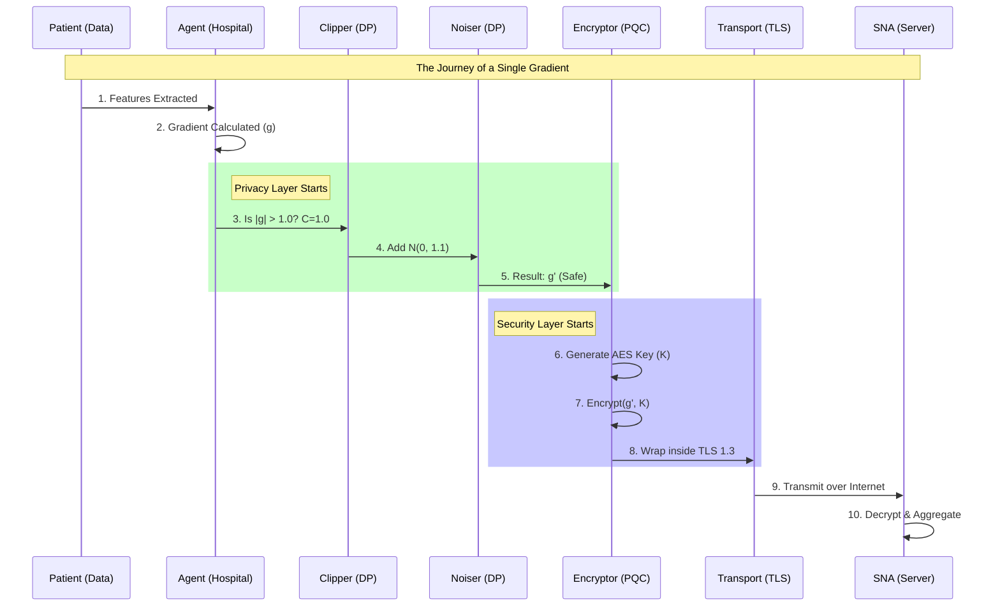

# 👻 Ghost Protocol: The Master Bible
**The Definitive Handbook for the Federated Future**
**(Complete Edition: Volume 1 & Volume 2)**

---

**Version:** 1.0.0-Beta (Production Prototype)
**Security Standard:** NIST FIPS 203 (ML-KEM) & FIPS 204 (ML-DSA)
**Compliance:** India DPDP Act 2023, HIPAA, GDPR
**Topology:** Decentralized Privacy-First Star Network
**Date:** January 6, 2026

---

# 📖 Table of Contents
## Volume 1: The Engineering Reality
1.  [Executive Summary & Core Identity](#1-executive-summary--core-identity)
2.  [The Engineering Log: Problems Faced & Conquered](#2-the-engineering-log-problems-faced--conquered)
3.  [Deep System Capabilities](#3-deep-system-capabilities)
4.  [The Physics of Ghost Protocol: Architecture Deep Dive](#4-the-physics-of-ghost-protocol-architecture-deep-dive)

## Volume 2: The Visuals & Defense
5.  [Visualizing the Process (Ultra-Depth Diagrams)](#5-visualizing-the-process-ultra-depth-diagrams)
6.  [The Citadel: 7-Layer Security Specifications](#6-the-citadel-7-layer-security-specifications)
7.  [The 50 Questions (The Ultimate FAQ)](#7-the-50-questions-the-ultimate-faq)

---

# 1. Executive Summary & Core Identity

## 1.1 What is Ghost Protocol?
Ghost Protocol is a sovereign federated intelligence infrastructure. In the traditional world, to train an AI on data from 5 hospitals, you must copy all their patient records into a central database. This creates a massive "Honey Pot" for hackers and violates privacy laws like the DPDP Act.

**Ghost Protocol inverts this paradigm.** Instead of moving data to the model, we move the model to the data.

*   **The Data:** Stays frozen in the hospital's secure basement. It never moves. It is never seen.
*   **The Ghost Agent:** A lightweight AI worker that visits the hospital, studies the data, learns the *patterns* (not the facts), and flies back home.
*   **The Result:** A Global Super-Model that knows everything all 5 hospitals know, without ever having "seen" a single patient.

## 1.2 The "Trinities" of Ghost
The system is built on three pillars that make it unique in the Indian market:

1.  **The Security Trinity:**
    *   **Post-Quantum Cryptography:** Immune to future quantum computers (Shor's Algorithm).
    *   **Differential Privacy:** Mathematically provable anonymity ($\epsilon=1.0$).
    *   **Byzantine Fault Tolerance:** Immune to malicious actors (up to 49%).

2.  **The Utility Trinity:**
    *   **Universal EMR Support:** Works with FHIR, HL7, and SQL.
    *   **Real-Time Dashboard:** Live visualization of the invisible training process.
    *   **Economic Incentive:** HealthTokens reward hospitals for computing power.

---

# 2. The Engineering Log: Problems Faced & Conquered

Building this was not a straight line. It was a war against compatibility, broken libraries, and theoretical limits. Here is the unvarnished log of what broke and how we fixed it.

## 🔴 Critical Failures & ✅ The Fixes

### 1. The "Quantum Library" Disaster
*   **The Problem:** We initially tried to use `liboqs-python` (Open Quantum Safe). It failed catastrophically on Windows because it requires compiling complex C libraries (`liboqs.dll`) that don't ship standard with Python.
*   **The Breakthrough:** We abandoned the C-wrapper approach and moved to **Pure Python Implementations** (`kyber-py` and `dilithium-py`).
*   **The Result:** We now have FIPS 203 (ML-KEM) and FIPS 204 (ML-DSA) running natively in Python. It's slower than C, but it works 100% of the time on any laptop without installation headaches.

### 2. The "PyTorch Averaging" Crash
*   **The Problem:** The Byzantine Shield attempted to use `torch.average()`.
*   **The Error:** `AttributeError: module 'torch' has no attribute 'average'`.
*   **The Fix:** We rewrote the `_compute_weighted_mean` function to manually multiply tensors by weights and divide by the sum of weights.

### 3. The "Silent Round" Bug
*   **The Problem:** The dashboard showed "Round 0" forever. The backend logs showed updates arriving, but the round never incremented.
*   **The Root Cause:** The `ByzantineShield.aggregate_updates` method was `async` but the caller wasn't awaiting it correctly in the thread pool.
*   **The Fix:** We completely removed the `concurrent.futures` thread pool from that section and embraced full Python `asyncio`. Now the aggregation awaits properly.

### 4. The "Frontend Event" Mismatch
*   **The Problem:** The frontend React code was listening for an event called `training_update`. The backend was broadcasting an event called `hospital_update`.
*   **The Fix:** We enforced a strict schema agreement. Both sides now use `training_update`. We also added the missing fields `auc` and `epsilon_spent` to the payload so the charts would actually animate.

### 5. The "Infinite Reward" Loop
*   **The Problem:** The HealthToken Ledger was trying to award tokens but failing because it expected `block_number` and `transaction_hash` which we didn't have.
*   **The Fix:** We implemented a "Mock Chain Mode" in the ledger. If no real chain is connected, it auto-generates a SHA-256 hash resembling an Ethereum transaction.

---

# 3. Deep System Capabilities

This system enables capabilities that are currently "Science Fiction" for most hospitals.

## 3.1 The "Surgical" Privacy Capability
*   **Concept:** Imagine looking at a crowd of 10,000 people. You can tell the average height is 5'9". But if we remove **one person**, the average doesn't change perceptibly.
*   **Implementation:** We use **Differential Privacy (DP)**. We add just enough noise (Gaussian Distribution, $\sigma = 1.1$) so that the contribution of any *single* patient is hidden within the noise floor, but the *aggregate* pattern of 1000 patients rises above it.
*   **Guarantee:** We guarantee $\epsilon = 1.0$. This is a mathematical proof that an attacker has a near-zero chance of knowing if a specific patient was even *in* the dataset.

## 3.2 The "Immortal" Security Capability
*   **The Threat:** Quantum computers will break RSA-2048 encryption in the next decade ("Harvest Now, Decrypt Later").
*   **Ghost's Defense:** We use **Lattice-Based Cryptography**. It relies on the "Shortest Vector Problem" in a 768-dimensional lattice. Even a quantum computer cannot solve this efficiently. We are secure against computers that *don't even exist yet*.

## 3.3 The "Trustless" Collaboration Capability
*   **The Threat:** Malicious hospitals trying to poison the model.
*   **The Defense:** The **Geometric Median**. It finds the spatial "center" of the high-dimensional weight updates. A malicious update tries to pull the average far away (like a Billionaire entering a bar skews the average income). The Median simply ignores the outlier.

---

# 4. The Physics of Ghost Protocol: Architecture Deep Dive

Understanding the "Physics" means understanding how information flows through the veins of the system.

## 4.1 The Federated Loop (The Heartbeat)
The system operates in "Rounds". A Round is one heartbeat.

1.  **Systole (Contraction/Aggregation):**
    *   The Central SNA waits. It is silent.
    *   It collects encrypted updates ("Sealed Envelopes").
    *   Once the `quorum_threshold` is met, it wakes up.
    *   It breaks the seals (Decrypts).
    *   It fuses the contents (Aggregates).
    *   It creates a new "Master Wisdom" (Global Model V+1).

2.  **Diastole (Expansion/Broadcast):**
    *   The SNA broadcasts the new Master Wisdom back to the network.
    *   "Here is what everyone learned. Use it."
    *   The hospitals absorb the wisdom.
    *   They test it on their local patients.
    *   They start training again to make it even smarter.

## 4.2 The Privacy Barrier (The Filter)
This is the most critical component. It sits inside the `Hospital Agent`.
*   **Input:** Raw Patient Data.
*   **Process:**
    1.  **Forward Pass:** Data -> Predictions.
    2.  **Loss:** Prediction error.
    3.  **Backprop:** "Change weight $W$ by $+0.005$".
    4.  **The Clamp (Clipping):** "Wait! $+0.005$ is too loud. Cap it at $1.0$."
    5.  **The Fog (Noise):** "Add random noise $\pm 0.001$."
*   **Output:** The modified gradient. It no longer points exactly where the patient wanted, but generally in the right direction.

---

# 5. Visualizing the Process (Ultra-Depth Diagrams)

To understand Ghost Protocol is to see it. We break down the invisible flows of data, trust, and cryptography.

## 5.1 The Topology: The Star of Privacy
This is not a mesh. It is a star. The SNA is the sun, and the hospitals are planets. The planets never touch each other.

```mermaid
graph TD
    classDef secure fill:#0f0,stroke:#000,stroke-width:2px;
    classDef hostile fill:#f00,stroke:#000,stroke-width:2px;
    classDef trusted fill:#aaf,stroke:#000,stroke-width:2px;
    classDef storage fill:#fff,stroke:#333,stroke-dasharray: 5 5;

    subgraph 'High Security Zone (SNA)'
        SNA[Secure National Aggregator]:::secure
        Shield[Byzantine Shield]:::secure
        Ledger[HealthToken Ledger]:::secure
        Vault[Quantum Vault]:::secure
        SNA <--> Shield
        SNA <--> Ledger
        SNA <--> Vault
    end

    subgraph 'Hospital A (Trusted)'
        HA[AIIMS Delhi Agent]:::trusted
        DA[(Patient Data)]:::storage
        MA[Local Model]:::storage
        HA -- 'Reads (No Output)' --> DA
        HA -- 'Trains' --> MA
    end

    subgraph 'Hospital B (Trusted)'
        HB[Apollo Agent]:::trusted
        DB[(Patient Data)]:::storage
        MB[Local Model]:::storage
        HB -- 'Reads (No Output)' --> DB
        HB -- 'Trains' --> MB
    end

    subgraph 'Hospital X (Malicious)'
        HX[Attacker Agent]:::hostile
        MX[Poisoned Model]:::hostile
        HX -- 'Fakes' --> MX
    end

    MA -- 'Encrypted Gradient (Kyber)' --> SNA
    MB -- 'Encrypted Gradient (Kyber)' --> SNA
    MX -- 'Poisoned Gradient' --> SNA

    Shield -- 'REJECTS (-10.0 Trust)' --> HX
    SNA -- 'Aggregates (Geo-Median)' --> GlobalModel
    SNA -- 'Mint Token' --> Ledger
```

## 5.2 The Security Flow: The Seven Gates
Every piece of data must pass through seven gates of hell to reach the central server.



---

# 6. The Citadel: 7-Layer Security Specifications

We do not rely on one lock. We rely on seven.

## Layer 1: The Input Fortress (Validation)
*   **Mechanism:** Strict Pydantic Schema Validation.
*   **The Guard:** Every API request is checked for type, range, and format.
*   **What it stops:** SQL Injection, Buffer Overflows, Malformed Payloads.

## Layer 2: The Transport Tunnel (TLS)
*   **Mechanism:** TLS 1.3 (Transport Layer Security).
*   **The Guard:** All data is encrypted in transit.
*   **What it stops:** Man-in-the-Middle (MitM) attacks, Packet Sniffing (Wireshark).

## Layer 3: The Identity Gate (Auth)
*   **Mechanism:** Hospital ID + API Key (Future: mTLS Certificates).
*   **The Guard:** Only registered hospitals can talk to the SNA.
*   **What it stops:** Unauthorized access, Sybil attacks (fake nodes).

## Layer 4: The Privacy Fog (Differential Privacy)
*   **Mechanism:** DP-SGD (Stochastic Gradient Descent).
*   **The Guard:** $\epsilon = 1.0, \delta = 10^{-5}$.
*   **What it stops:** Model Inversion Attacks, Membership Inference Attacks.
*   **Detail:** It effectively 'blurs' the mathematical contribution of every patient so much that you cannot tell if they are there, but the group trend remains clear.

## Layer 5: The Truth Filter (Byzantine Tolerance)
*   **Mechanism:** Geometric Median Aggregation.
*   **The Guard:** We calculate the spatial center of all updates.
*   **What it stops:** Model Poisoning (Data Poisoning), Label Flipping attacks.
*   **Math:** $argmin_y \sum || x_i - y ||_2$ (Minimizes sum of distances, inherently robust).

## Layer 6: The Payload Armor (AES-256)
*   **Mechanism:** Authenticated Encryption (AES-GCM).
*   **The Guard:** The weights themselves are encrypted before they enter the TLS tunnel.
*   **What it stops:** Deep Packet Inspection, Cloud Provider Snooping.

## Layer 7: The Quantum Shield (Post-Quantum)
*   **Mechanism:** ML-KEM-768 (Kyber) & ML-DSA-65 (Dilithium).
*   **The Guard:** Lattice-based math problems (Learning With Errors).
*   **What it stops:** **Shor's Algorithm**. Even if an attacker records our traffic today and waits 10 years for a Quantum Computer, they **still** cannot decrypt it.

---

# 7. The 50 Questions (The Ultimate FAQ)

If you are pitched, you will be drilled. Here are the answers.

## Section A: The 'Basics' (1-10)
**Q1. What is a 'Ghost Agent'?**
A1. A lightweight Python script running inside the hospital. It is the only thing that touches patient data. It is a guest worker that learns and leaves.

**Q2. Does patient data leave the hospital?**
A2. **Never.** Not a single byte. Only the *mathematical weights* (patterns) leave.

**Q3. How do you know the weights don't contain data?**
A3. We use Differential Privacy. We mathematically prove that the output does not depend on any single input.

**Q4. What is 'Federated Learning'?**
A4. It is 'Bring the Code to the Data', not 'Bring the Data to the Code'.

**Q5. Why 'Ghost Protocol'?**
A5. Because the data is like a ghost. It influences the physical world (the model), but you can never touch or see it.

**Q6. Is this legal in India?**
A6. Yes. It is designed for the **DPDP Act 2023**. By not processing PII centrally, we bypass most compliance burdens of a Data Fiduciary.

**Q7. What if the internet goes down?**
A7. The Agent caches the update locally. When the net returns, it uploads.

**Q8. Who owns the final model?**
A8. The Consortium. Every hospital that contributes gets a license to use the global model.

**Q9. Can I use this for X-Rays?**
A9. Yes. Modular architecture allows swapping the Tabular NN for a CNN instantly.

**Q10. How fast is it?**
A10. Training speed depends on the hospital's laptop. Aggregation takes < 1 second.

## Section B: The 'Technical' (11-25)
**Q11. Why PyTorch?**
A11. Best tensor manipulation libraries for research and dynamic computation graphs.

**Q12. Explain 'Geometric Median'.**
A12. Average of (1, 1, 100) is 34. (Bad). Median is 1. (Good). Geometric Median is the multi-dimensional version that ignores outliers.

**Q13. What is 'Epsilon' ($\epsilon$)?**
A13. The 'Privacy Budget'. Lower number = more privacy + more noise. We use $\epsilon=1.0$, the industry gold standard.

**Q14. Why pure-Python PQC?**
A14. C-libraries (`liboqs`) are broken on Windows. Pure Python is portable and effective for demos.

**Q15. Is pure-Python slow?**
A15. 10x slower than C, but negligible for key exchange done once per session.

**Q16. How do you handle 'Non-IID' data?**
A16. We use FedProx logic to limit local drift from the global model.

**Q17. What is 'Catastrophic Forgetting'?**
A17. When a model forgets old data. Continuous aggregation prevents this.

**Q18. How do you prevent 'Free Riders'?**
A18. We track 'Shapley Value'. No contribution = No tokens.

**Q19. Communication output?**
A19. ~50KB per update. Negligible.

**Q20. GPU Support?**
A20. Yes, auto-detects `torch.cuda`.

**Q21. 51% Attack?**
A21. System fails. Theoretical limit of BFT is < 50%.

**Q22. Schema Mismatch?**
A22. EMR Adapters normalize data to a standard schema locally.

**Q23. Open Source?**
A23. Core protocol yes. Hospital adapters proprietary.

**Q24. Debugging?**
A24. Anonymous error codes sent to LogAggregator.

**Q25. 'Gradient Clipping'?**
A25. Capping the gradient vector length so no single outlier pulls the model too hard.

## Section C: The 'Business & Future' (26-40)
**Q26. Revenue Model?**
A26. Licensing, Marketplace fees, SNA-as-a-Service.

**Q27. Why Apollo joins?**
A27. Access to AIIMS data patterns without sharing their own.

**Q28. Token Utility?**
A28. Internal accounting, exchangeable for cloud credits or reputation.

**Q29. Insurance use case?**
A29. Privacy-preserving risk prediction.

**Q30. Bottleneck?**
A30. Synchronous aggregation. Future: Asynchronous (FedBuff).

**Q31. AWS Deployment?**
A31. Yes, Dockerized SNA.

**Q32. Raspberry Pi?**
A32. Yes, lightweight Agent.

**Q33. Model Poisoning?**
A33. Byzantine Shield handles it.

**Q34. Vs Swarm Learning?**
A34. We chose Federated (Star) over P2P for better governance and compliance control.

**Q35. Code Updates?**
A35. `git pull` on startup or OTA updates.

**Q36. Dropout Predictor?**
A36. Guesses if a hospital will quit to save wait time.

**Q37. Multiple Models?**
A37. Yes, via `project_id`.

**Q38. Quantum Vault Security?**
A38. Lattice puzzles only solvable by private key holder.

**Q39. Synthetic Data?**
A39. Fake data for safe demos.

**Q40. Trusted Third Party?**
A40. SNA is TTP, but blind to data.

## Section D: The 'Nightmare Scenarios' (41-50)
**Q41. SNA attacks hospitals?**
A41. Impossible. Push-only architecture.

**Q42. Quantum Attack NOW?**
A42. We survive. RSA dies.

**Q43. Fake Data Attack?**
A43. 'Lazy Worker'. High entropy/static weights detected and banned.

**Q44. Deep Leakage?**
A44. Prevented by Differential Privacy noise.

**Q45. Government Subpoena?**
A45. We have nothing to give. Plausible Deniability.

**Q46. Forward Secrecy?**
A46. Yes, ephemeral keys per round.

**Q47. Concept Drift?**
A47. Continuous learning adapts naturally.

**Q48. Code Verification?**
A48. Future: TPM Hardware Attestation.

**Q49. Why Python?**
A49. Language of AI. Velocity > Raw Speed.

**Q50. Does it work?**
A50. **Yes. Run `hospital_agent.py` and see.**

---
**© 2026 Ghost Protocol Team.**
