# 👻 Ghost Protocol
**Privacy-Preserving AI Training on Decentralized Healthcare Data**


---

## 🛑 The Truth About Privacy AI
Most collaborative learning demos are fake. They simulate distributed networks on a single CSV file and call it a day.

**Ghost Protocol is different.** 
This is a true **Federated Learning (FL)** system designed for the hostile reality of healthcare data privacy (DPDP/GDPR). It allows hospitals to collaboratively train lifesaving AI models **without a single byte of patient data ever leaving their premises.**

> *"We don't move the data to the model. We move the model to the data."*

---

## 🛠️ Key Innovations

### 1. 🔒 Real Homomorphic Encryption (NO SIMULATIONS)
We rely on **Paillier Encryption** (via `phe` library) to encrypt model gradients.
*   The "Secure National Aggregator" performs **Homomorphic Addition** on encrypted ciphertexts.
*   The server *never* sees the raw updates, only the mathematical sum.
*   *Proof:* Check `run_secure_protocol.py` for the implementation.

### 2. 🧠 Differential Privacy (Opacus)
We don't just "hope" for privacy; we calculate it.
*   Strict implementation of **Opacus** (PyTorch) to inject Gaussian noise.
*   Guaranteed **(ε, δ)-Differential Privacy** budget tracking.
*   Prevents model inversion attacks (reconstructing patient faces/data from weights).

### 3. 🛡️ Byzantine Shield
Distributed systems are vulnerable to "Poisoning Attacks" (malicious nodes).
*   Our **Shapley Value** analysis automatically detects and quarantines nodes that contribute harmful gradients.

---

## 🚀 Quick Start

### Prerequisites
*   Python 3.9+
*   Redis (for message queue)

### 1. Clone & Install
```bash
git clone https://github.com/yourusername/ghost-protocol.git
cd ghost-protocol
pip install -r requirements.txt
```

### 2. Run the "Real Math" Demo
Witness the full cryptographic cycle (Encryption -> Aggregation -> Decryption) on your local machine.
```bash
python run_secure_protocol.py
```
*warning: This script performs real 1024-bit encryption. It is computationally intensive.*

---

## 🏗️ Architecture

```mermaid
flowchart TD
    %% Nodes
    User([🚀 Start Training])
    
    subgraph Cloud ["☁️ Untrusted Information Exchange (The Internet)"]
        SNA["🏢 Secure National Aggregator <br/> (Violates Privacy if Data leaks)"]
        GlobalModel{"🧠 Global Model State"}
    end

    subgraph HospitalA ["🏥 Appollo Hospital (Secure Enclave)"]
        DataA[("📂 Patient Data <br/> (Never Leaves)")]
        LocalModelA["⚙️ Local Model"]
        NoiseA["🎲 Opacus Engine <br/> (Differential Privacy)"]
        EncryptA["🔒 Paillier Encryption <br/> (Homomorphic)"]
    end

    subgraph HospitalB ["🏥 AIIMS Hospital (Secure Enclave)"]
        DataB[("📂 Patient Data <br/> (Never Leaves)")]
        LocalModelB["⚙️ Local Model"]
        NoiseB["🎲 Opacus Engine <br/>(Differential Privacy)"]
        EncryptB["🔒 Paillier Encryption <br/> (Homomorphic)"]
    end

    %% Logic Flow
    User -->|1. Initialize| SNA
    SNA -->|2. Broadcast Logic| LocalModelA
    SNA -->|2. Broadcast Logic| LocalModelB

    DataA -->|3. Train| LocalModelA
    LocalModelA -->|4. Add Noise| NoiseA
    NoiseA -->|5. Encrypt Weights| EncryptA
    
    DataB -->|3. Train| LocalModelB
    LocalModelB -->|4. Add Noise| NoiseB
    NoiseB -->|5. Encrypt Weights| EncryptB

    EncryptA -->|6. Send Ciphertext| SNA
    EncryptB -->|6. Send Ciphertext| SNA

    SNA -->|7. Blind Aggregation| GlobalModel
    GlobalModel -.->|8. Distribute New Intelligence| LocalModelA
    GlobalModel -.->|8. Distribute New Intelligence| LocalModelB
    
    %% Styling
    style Cloud fill:#f9f9f9,stroke:#333,stroke-width:2px,stroke-dasharray: 5 5
    style HospitalA fill:#e1f5fe,stroke:#01579b
    style HospitalB fill:#e1f5fe,stroke:#01579b
    style SNA fill:#ffcdd2,stroke:#b71c1c
    style DataA fill:#fff9c4,stroke:#fbc02d
    style DataB fill:#fff9c4,stroke:#fbc02d
```




## 🤝 Contributing & Security (The "Hybrid" Approach)
**Privacy is a moving target.** While we rely on mathematically proven libraries (`opacus`, `phe`), implementation bugs are always possible.

We believe in **"Security through Visibility"**, not obscurity.
*   **Found a bug?** Please open an Issue. We treat security reports with highest priority.
*   **Want to break it?** We invite cryptographers and engineers to audit the `run_secure_protocol.py` implementation.
*   **Pull Requests:** Welcome! Help us optimize the Paillier encryption steps or different model architectures.

We are building this *with* the community, not just *for* it.

## 📜 License
This project is open-sourced under the MIT License.
Simulations are easy. Privacy is hard. We chose the hard way.